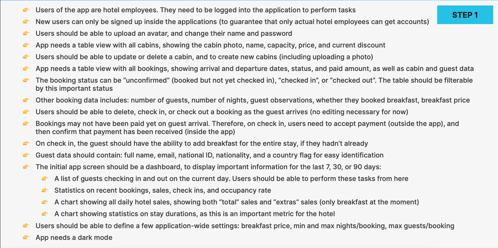
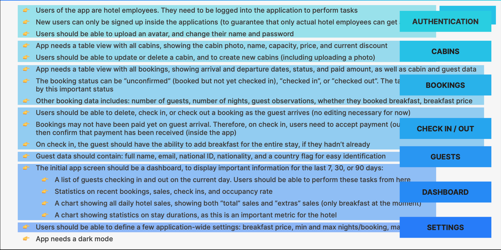
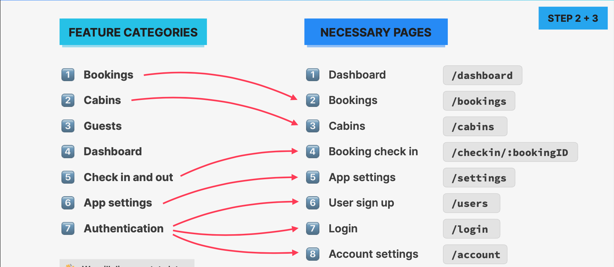
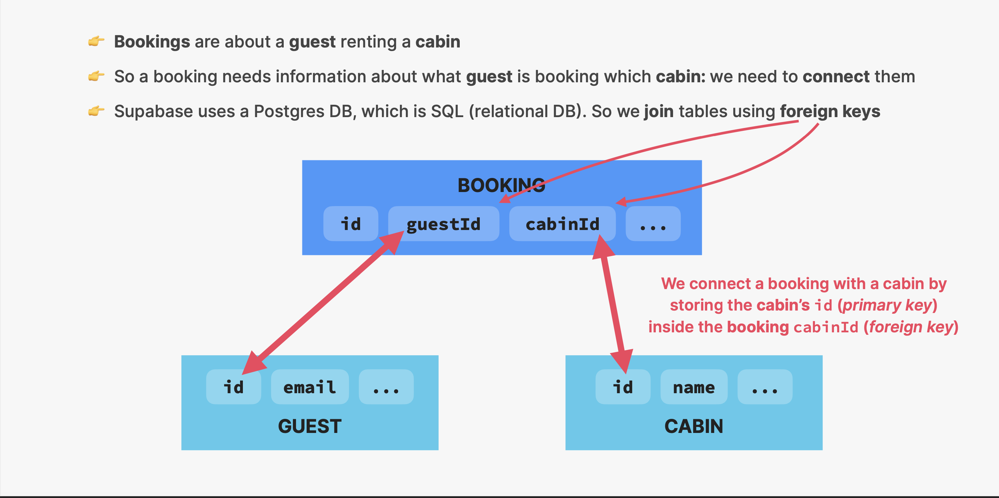
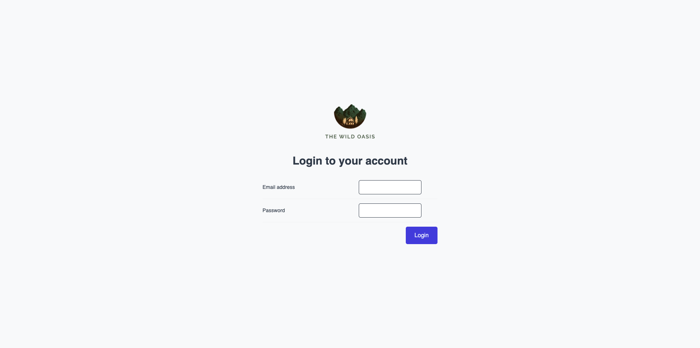
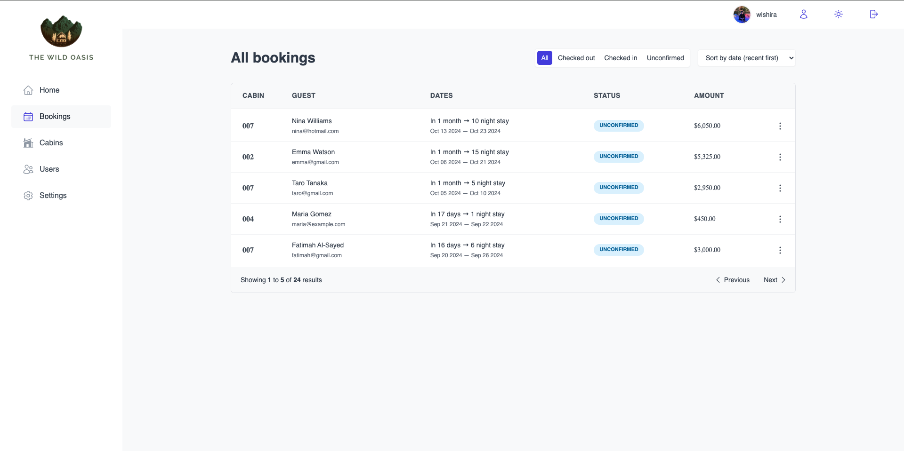
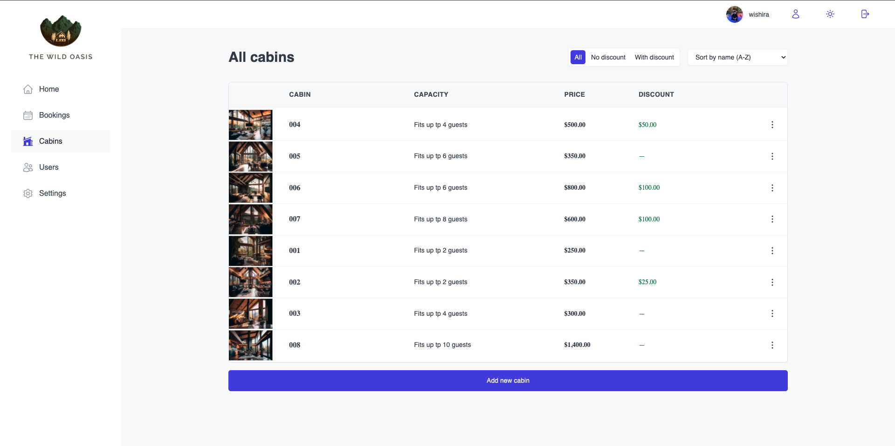
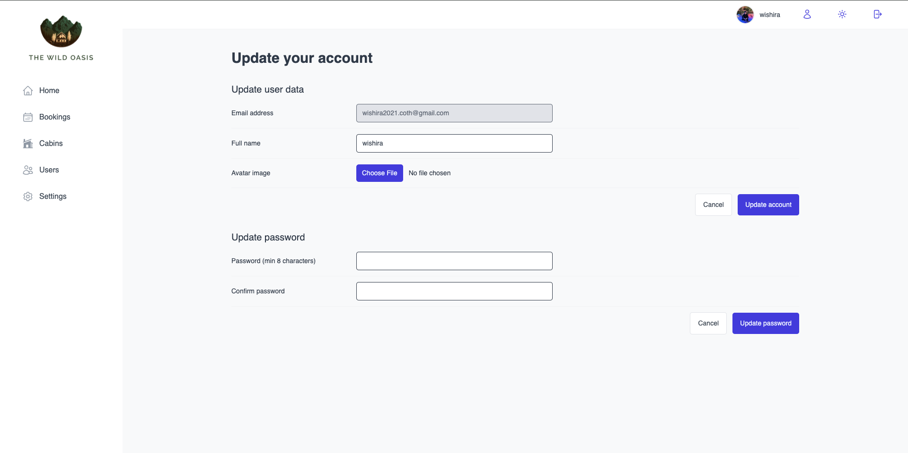
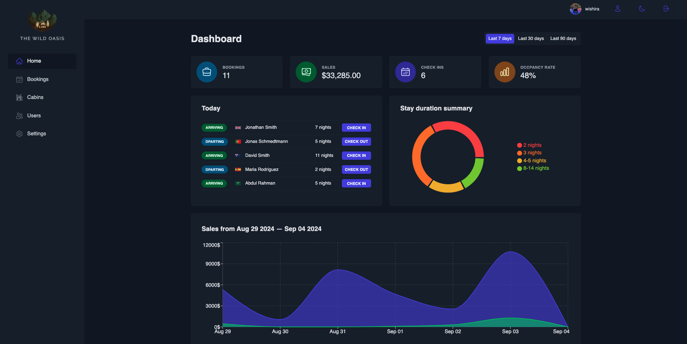

# The Wild Oasis

<br/>
<p align="center">
  
</p>

<br/>

 

## About

* “The Wild Oasis” is a small boutique hotel with 8
luxurious wooden cabins

* They need a custom-built application to manage
everything about the hotel: bookings, cabins
and guests

* Later they will probably want a customer-facing
website as well, where customers will be able to
book stays, using the same API

## Test
Link: https://the-wild-osis.vercel.app/

## Project requirements from the business
 
  

## Features + Pages
  

## Technology
  

## Server side
  
  


## Showcase
 
 
 
 
 

## Dark mode
 

## Getting Started

1. **Clone the Repository**:

    ```bash
    git clone https://github.com/your-username/wild-oasis.git
    ```

2. **Navigate to the Project Directory**:

    ```bash
    cd the-wild-osis
    ```

3. **Install Dependencies**:

    ```bash
    npm install
    ```

4. **Start the Development Server**:

    ```bash
    npm run dev
    ```

## Credit
Special thanks to Jonas for the insightful and comprehensive "Ultimate React" course on Udemy. His expertise and clear explanations have significantly enhanced my understanding of React and modern web development practices. The course's hands-on approach and well-structured content have been invaluable in advancing my skills and knowledge in React.
