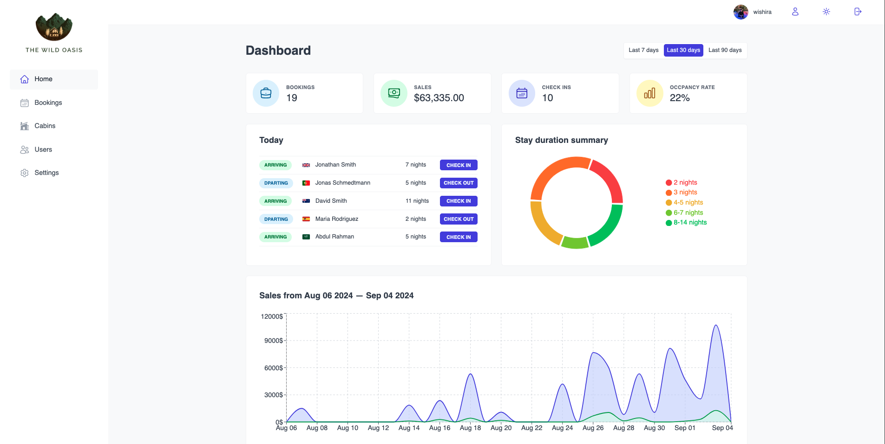
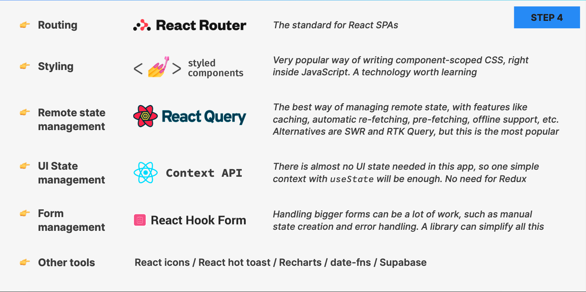

# The Wild Oasis

<br/>
<p align="center">
  
</p>

<br/>

 

## About

* “The Wild Oasis” is a small boutique hotel with 8
luxurious wooden cabins

* They need a custom-built application to manage
everything about the hotel: bookings, cabins
and guests


* This is the internal application used inside the
hotel to check in guests as they arrive


* They have nothing right now, so they also need
the API


* Later they will probably want a customer-facing
website as well, where customers will be able to
book stays, using the same API

## Test
Link: https://the-wild-osis.vercel.app/

Email: wishira2021.coth@gmail.com

Password: 111111111


## Project requirements from the business
 
  

## Features + Pages
  

## Technology
  

## Server side
  

## Page
 
 
 
 
 

## Dark mode
 

## Learning Objectives

- **Component-Based Architecture**: Understand how to build and manage reusable components in React such as compounding component.
- **Routing**: Implement client-side routing with React Router for navigation between different pages.
- **API Integration**: Fetch and handle data from external APIs to dynamically update the user interface.
- **Form Handling**: Create and validate forms to handle user inputs effectively.


## Getting Started

1. **Clone the Repository**:

    ```bash
    git clone https://github.com/your-username/wild-oasis.git
    ```

2. **Navigate to the Project Directory**:

    ```bash
    cd the-wild-osis
    ```

3. **Install Dependencies**:

    ```bash
    npm install
    ```

4. **Start the Development Server**:

    ```bash
    npm run dev
    ```

## Credit
Special thanks to Jonas for the insightful and comprehensive "Ultimate React" course on Udemy. His expertise and clear explanations have significantly enhanced my understanding of React and modern web development practices. The course's hands-on approach and well-structured content have been invaluable in advancing my skills and knowledge in React.
